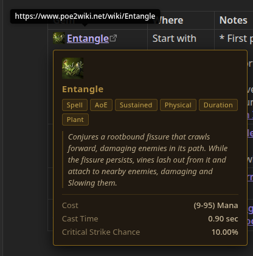

# Obsidian PoE2 Wiki Tooltips

An [Obsidian](https://obsidian.md) plugin that shows hover tooltips for [poe2wiki.net](https://www.poe2wiki.net) links, displaying gem and skill information inline without leaving your notes.

## Features

- Hover any poe2wiki.net link to see a tooltip with the gem's description, tags, and stats
- Gem icons are injected inline next to each link
- Data is fetched and cached on note load, so tooltips appear instantly after the first visit



## Installation

This plugin is not yet in the Obsidian community plugin directory. To install manually:

1. Download `main.js`, `manifest.json`, and `styles.css` from the [latest release](https://github.com/mattlorey/obsidian-poe2-wiki-tooltips/releases)
2. Copy them into your vault at `.obsidian/plugins/poe2-wiki-tooltips/`
3. In Obsidian: **Settings → Community Plugins** → disable Restricted Mode → enable **Path of Exile 2 Wiki Tooltips**

## Development

```bash
git clone https://github.com/mattlorey/obsidian-poe2-wiki-tooltips
cd obsidian-poe2-wiki-tooltips
npm install
```

Symlink the folder into your vault's plugins directory:

```bash
ln -s $(pwd) /path/to/your/vault/.obsidian/plugins/poe2-wiki-tooltips
```

Then start the watcher:

```bash
npm run dev
```

After each build, reload the plugin in Obsidian (disable → re-enable, or use the [Hot Reload](https://github.com/pjeby/hot-reload) community plugin).

## Usage

Link any text to a poe2wiki.net page and the plugin handles the rest:

```markdown
Use [Entangle](https://www.poe2wiki.net/wiki/Entangle) with
[Unleash](https://www.poe2wiki.net/wiki/Unleash) support.
```

Tooltips only appear in **Reading mode**.
